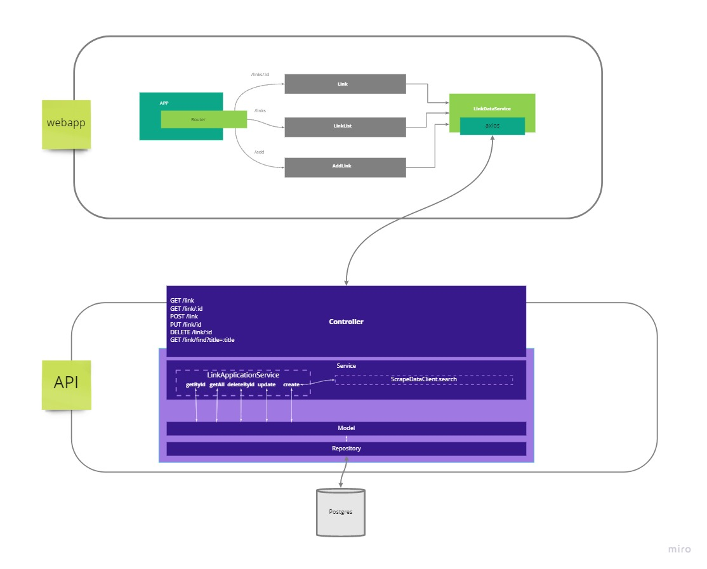

# Let's scrap

This is an implementation of an app that finds all links inside a given url.
It uses [Spring Boot](https://spring.io/projects/spring-boot) with [Kotlin](https://kotlinlang.org/) and the library [Skrape.it](https://github.com/skrapeit/skrape.it) under the hood.

### Rules
This is my implementation to solve the following problem: 

Given an url to a webpage, you need to find all links inside it. 
The system must be able to: 
- find all links inside a given url
- save all links found in a database (SQL or NoSql)
- allow list the data saved for each url

The code must:
- have unit tests
- be easy to setup and run using docker
- be deployed on a cloud environment (also using docker)

### The solution

For this project, I have used two different technologies and two different approaches: 

- To handle transactions with the database, I have choosen to create a rest api that allows you to create, update, delete and find a link.
- As a sample application that would use the api. Inside the [front directory of this repo](https://github.com/ksetoue/kotlinwebscraper/tree/main/front), you can find a Vue app that provides a simple frontend to insert, update, delete and list the results of the api. 

### Architecture
The system consists of two applications, as mentioned above, and the figure bellow attempts to describe how they both interact with each other. 



### The API
This springboot project was designed with restful api concepts and DDD principles in mind. 
You will notice that the application tries to apply some of the principles present inside the [reactive manifesto](https://www.reactivemanifesto.org/), specially regarding the concerns or responsiveness and resilience.

The main layers in which this api is divided are: 
- port: 
  - controller: responsible for handling endpoint requests and returning the correct status code for each one
  - client: abstract implementations for external libraries and clients
- application: the main role is to handle business logic 
- domain:
  - dto: definition of data transfer objects
  - model: both classes and interfaces that represent concepts of the data models for this application 

### the webapp
Not my strong suit, but I did my best :) 

It's a simple vue application that uses bootstrap to give better looks to the components.

## Running

To run this project, make sure that you have the following requirements installed on your environment: 

- [Docker](https://docs.docker.com/engine/install/)
- [docker-compose](https://docs.docker.com/compose/install/)
- [git](https://git-scm.com/book/en/v2/Getting-Started-Installing-Git)

#### step-by-step
1. Download this repo
```sh
$ git clone https://github.com/ksetoue/kotlinwebscraper.git
````

2. make run the following docker commands on your console or terminal:
```sh
$ docker-compose -f docker-compose.dev.yml up --build #to run locally
# or 
$ docker-compose up --build #to run in a production like environment

```

**P.S.:** remember that this application uses a docker-compose file, which means that it sets up a postgres container as database. 
I recommend setting up the following environment variables in case you decide to run it in a managed database: 
``DB_HOST``, `DB_PORT`, `DB_NAME`, `DB_USERNAME` and `DB_PASSWORD` 


